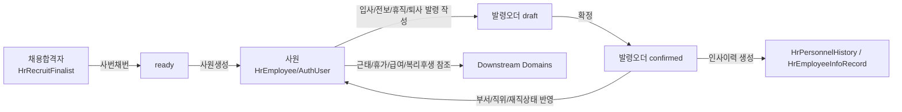

# HR-Domain-Map

> 기준: 2026-04-25 UTC repo 실제 상태 분석. 코드 수정/커밋/푸시 없음.

## HR Core 흐름

## 구현된 화면/API 매핑

| 영역 | 화면 | registry | 주요 컴포넌트 | Backend |
|---|---|---|---|---|
| 채용합격자 | `/hr/recruit/finalists` | `hr.recruit.finalists` | `hr-recruit-finalist-manager.tsx` | `api/hr_recruit.py`, `services/hr_recruit_service.py` |
| 사원마스터 | `/hr/employee` | `hr.employee` | `employee-master-manager.tsx` | `api/employee.py`, `services/employee_*` |
| 발령기록 | `/hr/appointment/records` | `hr.appointment.records` | `hr-appointment-record-manager.tsx` | `api/hr_appointment_record.py`, `services/hr_appointment_record_service.py` |
| 발령코드 | `/hr/appointment/codes` | `hr.appointment.codes` | `hr-appointment-code-manager.tsx` | `api/hr_appointment_code.py`, `services/hr_appointment_code_service.py` |

## 실제 구현 상태

### 1) 채용합격자
- CRUD, IF 동기화 endpoint, 사번채번, 선택 합격자 사원 생성 기능 존재.
- 상태값: `draft | ready | appointed`.
- 상태 전이는 `hr_recruit_service.py`에서 제한하지만, 발령 확정 이벤트와 `appointed` 자동 동기화는 확인되지 않음.

### 2) 사원마스터
- 사원 생성 시 `AuthUser`와 `HrEmployee`가 함께 생성됨.
- `/hr/employee`는 `useMenuActions("/hr/employee")`와 backend action gate(`query`, `save`)가 pilot 적용됨.
- 삭제 시 근태/휴가/급여/발령 참조 관련 정리 로직이 있어 도메인 결합도가 높음.

### 3) 입사발령/발령확정
- 발령 생성 시 직원 현재 부서/직위/재직상태가 `from_*`으로 저장됨.
- 신규입사성 action이면 `to_employment_status="active"` 자동 지정 로직 존재.
- 확정 시 직원 부서/직위/재직상태 변경, `HrPersonnelHistory`, `HrEmployeeInfoRecord` 생성.
- 발령 확정 후 합격자 상태/링크를 되돌려 갱신하는 로직은 없음.

## 핵심 빈틈

1. **채용-발령 폐루프 미완성**
   - 사원생성 후 발령 화면 이동은 있으나, 발령확정 결과가 합격자 `appointed`로 자동 기록되지 않음.
2. **대기상태 의미 정리 필요**
   - 합격자 기반 사원 생성 시 `employment_status="leave"`, 직위 `채용대기`로 생성됨. 입사 전 상태로는 동작하지만 명칭상 `leave`가 휴직과 혼재될 수 있음.
3. **권한 적용 범위 편차**
   - 사원마스터는 action gate pilot 적용. 합격자/발령 API에는 같은 수준의 action gate 확인 안 됨.

## 다음 Task 후보

1. 발령 확정 시 `employee_no` 기준 합격자 `status_code="appointed"` 자동 갱신.
2. 입사대기 상태 코드(`pre_hire` 등) 도입 여부 검토 또는 `leave` 의미 문서화.
3. 합격자/발령 화면에 `useMenuActions` + backend action gate 적용 범위 확대.
