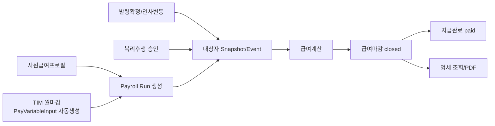

# Payroll-Cycle

> 기준: 2026-04-25 UTC repo 실제 상태 분석. 코드 수정/커밋/푸시 없음.

## 현재 Payroll 폐루프

## 구현된 화면/API 매핑

| 영역 | 화면 | registry | 주요 컴포넌트/API | 상태 |
|---|---|---|---|---|
| 급여코드 | `/payroll/codes` | `payroll.codes` | `payroll-code-manager.tsx` | 구현 |
| 항목그룹 | `/payroll/item-groups` | `payroll.item-groups` | `pay-item-group-manager.tsx` | 구현 |
| 수당/공제 | `/payroll/allowance-deduction-items` | `payroll.allowance-deduction-items` | `pay-allowance-deduction-manager.tsx` | 구현 |
| 사원급여프로필 | `/payroll/employee-profiles` | `payroll.employee-profiles` | `/api/pay/employee-profiles/batch` | 구현 |
| 변수입력 | `/payroll/variable-inputs` | `payroll.variable-inputs` | `/api/pay/variable-inputs/batch` | 구현 |
| 급여 Run | `/payroll/runs` | `payroll.runs` | `/api/pay/runs/*` | 구현 |
| 본인 명세 | API 중심 | - | `/api/pay/my/payslips`, PDF | 구현 |

## 실제 구현 상태

### 대상자 생성/Snapshot
- Run 생성 시 `year_month + payroll_code_id` 중복 방지.
- 대상자는 해당 기간의 active 급여프로필과 사원 상태를 기준으로 materialize.
- snapshot에는 사번/이름/부서/재직상태/기본급/급여프로필/기간 정보가 저장됨.
- 발령확정, 휴가 승인, 급여프로필 변경, 복리후생 승인 이벤트를 target event로 수집.

### 계산
- 기본급(`BSC`) + 수기/자동 변수(`PayVariableInput`) + 복리후생 승인건 + 법정공제 계산.
- 소득세 구간/세율 마스터 누락 시 warning을 남김.
- review event가 있으면 직원별 warning 상태로 표시.
- Run 상태는 계산 후 `calculated`.

### 마감/지급
- `calculated → closed → paid` 상태 전이 구현.
- closed/paid 상태에서는 재계산/스냅샷 갱신 차단.
- closed/paid Run은 본인 명세 조회와 PDF 다운로드 가능.

## 주요 빈틈

1. **선행 마감 강제 부족**
   - 급여 Run 생성/계산 전 TIM 월마감 완료가 필수로 검증되지 않는다.
2. **복리후생 반영 시점 부작용**
   - 계산 중 approved 복리후생을 `payroll_reflected`로 갱신한다. 계산/재계산 취소 정책이 없으면 상태 복구가 어려울 수 있다.
3. **closed 이후 정정 정책 없음**
   - closed/paid 되돌리기, 차액정산, 정정 Run 정책이 미정.
4. **지급/회계 연계 없음**
   - 지급파일, 은행이체, 회계전표 export는 확인되지 않음.

## 다음 Task 후보

1. Run 생성/계산 전 readiness checklist 추가: TIM 월마감, 급여프로필 누락, 승인 복리후생 미반영건.
2. closed run 정정 정책 설계: reopen 금지/허용, 차액정산 Run, audit event.
3. 지급파일/회계전표 최소 export 포맷 정의 및 화면 액션 권한 설계.
