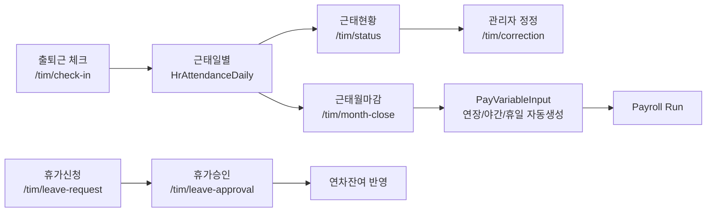

# TIM-Cycle

> 기준: 2026-04-25 UTC repo 실제 상태 분석. 코드 수정/커밋/푸시 없음.

## 현재 TIM 폐루프

## 구현된 화면/API 매핑

| 영역 | 화면 | registry | 주요 컴포넌트/API | 상태 |
|---|---|---|---|---|
| 출퇴근 | `/tim/check-in` | 미등록(custom) | `attendance-checkin-manager.tsx`, `/api/tim/attendance-daily/check-in|check-out` | 구현 |
| 근태현황 | `/tim/status` | `tim.attendance-status` | `attendance-status-manager.tsx`, `tim_attendance_daily.py` | 구현 |
| 근태정정 | `/tim/correction` | 미등록(custom) | `attendance-correction-manager.tsx`, `/{attendance_id}/correct` | 관리자 직접 정정 |
| 휴가신청 | `/tim/leave-request` | 미등록(custom) | `leave-request-manager.tsx`, `/api/tim/leave-requests` | 구현 |
| 휴가승인 | `/tim/leave-approval` | `tim.leave-approval` | `leave-approval-manager.tsx`, approve/reject API | 구현 |
| 월마감 | `/tim/month-close` | `tim.month-close` custom/standard-v1 | `tim-month-close-manager.tsx`, `tim_month_close_service.py` | 구현 |

## 실제 구현 상태

### 출퇴근/근태일별
- `check_in()`은 오늘 일정 기준 지각 여부를 계산하고 `HrAttendanceDaily`를 생성/갱신.
- `check_out()`은 퇴근 기록 후 `tim_work_hours_calc_service.calculate_and_save()`로 근무시간을 계산.
- 근태현황은 기간/상태 검색 및 정정 화면 이동을 제공.

### 정정/승인
- 근태 정정은 `HrAttendanceCorrection` 이력 생성 후 즉시 `HrAttendanceDaily`를 변경.
- 정정 API는 HR/admin 권한이며 월마감된 기간은 `assert_month_not_closed()`로 차단.
- 단, 직원 신청 → 승인자 승인 → 반영 구조가 아니라 관리자 직접 수정 구조임.

### 휴가 신청/승인
- 직원은 본인 휴가 신청/취소 가능.
- HR/admin은 pending 휴가를 승인/반려 가능.
- 연차 승인 시 `TimAnnualLeave.used_days` 증가, 승인취소/회수 시 복구 로직 존재.
- Payroll은 승인된 무급휴가를 review event로 수집함.

### 월마감
- 월마감 시 해당 월 근무시간 재계산 후 집계값 저장.
- 연장/야간/휴일 근무분은 `PayVariableInput`으로 upsert되어 급여 계산에 투입됨.
- 재오픈 API 존재.

## 주요 빈틈

1. **근태 승인 루프 부재**
   - 근태 정정은 승인 workflow가 아니라 HR/admin 직접 수정이다.
2. **마감 lock 범위 제한**
   - 현재 `assert_month_not_closed()`는 정정 API에서만 확인된다. 휴가 승인/취소, 급여 변수 입력 등 월마감 영향 작업의 lock 정책은 추가 검토 필요.
3. **라우트/권한 path 혼재**
   - `config/grid-screens.json`과 bootstrap에는 `/tim/month-close`가 있으나, legacy `/tim/month-closing` 페이지와 `useMenuActions("/tim/month-closing")`도 존재한다.
4. **Payroll 선행조건 약함**
   - 급여 Run 생성/계산 전에 해당 월 TIM 마감 완료를 강제하지 않는다.

## 다음 Task 후보

1. 근태 정정 신청/승인 도메인 추가: `submitted → approved/rejected → applied`.
2. `/tim/month-close`로 메뉴/권한/useMenuActions path 정리.
3. Payroll Run 생성/계산 전 TIM 월마감 필수 검증 추가.
